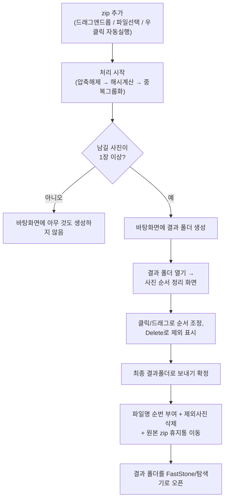

# 중복 사진 정리 도구 (PhotoDedup)

zip으로 압축된 사진 묶음에서 **내용이 동일하거나 사실상 같은 중복 사진**을 자동으로 찾아, 각 중복
그룹에서 **압축파일 내 순서상 가장 먼저 등장한 사진 1장만** 남기고 **바탕화면에 결과 폴더 하나만**
만들어주는 Windows 데스크톱 프로그램입니다. 정리가 끝나면 큰 화면에서 사진 순서를 손으로 다시
맞추고 확정할 수 있는 편집 화면도 함께 제공합니다.

## 주요 기능

- 파일명이 달라도 사진 **"내용"**으로 중복을 판별합니다 (완전 동일 파일 + 재압축/화질변경 등
  사실상 같은 사진까지 pHash로 탐지, 회전/좌우반전 옵션 지원)
- zip을 창에 **드래그 앤 드롭**하거나 파일 선택 버튼으로 추가, 여러 zip 동시 처리 가능
- 탐색기에서 zip을 **우클릭 → "중복 사진 정리 도구로 열기"** 한 번으로 처리~결과폴더 열기까지 자동 진행
- 결과 폴더에서 **사진 순서를 그리드 화면으로 직접 편집** (클릭/Shift+클릭 선택, 드래그 재정렬,
  Delete로 제외 표시, Ctrl+Z 실행취소)
- 확정 시 파일명에 순번 부여, 원본 zip은 완전삭제 대신 **휴지통으로 이동**(복구 가능), 결과 폴더를
  FastStone Image Viewer(설치돼 있으면) 또는 탐색기로 자동 오픈
- 리포트 파일이나 zip 재압축 등 불필요한 부산물 없이, **바탕화면 폴더 하나**로만 결과를 남김

## 프로그램 화면

> 현재 저장소에는 스크린샷이 포함되어 있지 않습니다. tkinter 기반 데스크톱 GUI로, 메인 창(zip
> 추가/옵션/진행률), 사진 순서 정리 창(그리드뷰), 제외된 중복 사진 미리보기 팝업 3개 화면으로
> 구성되어 있습니다.

## 전체 Workflow



## 설치 방법

### 방법 A — 설치 파일 사용 (초보 사용자용)

1. [Releases](../../releases) 페이지에서 최신 버전의 `PhotoDedup_Setup_*.exe`를 내려받습니다.
2. 실행 후 마법사를 따라 설치합니다. "탐색기에서 zip 파일 우클릭 시 ... 메뉴 추가" 옵션을 켜두면
   나중에 zip을 우클릭해서 바로 실행할 수 있습니다.
3. 설치가 끝나면 시작 메뉴 또는 바탕화면 바로가기로 실행합니다.

### 방법 B — 소스코드 실행 (개발자용)

```bash
git clone https://github.com/cjhtop9234ppp-tech/photo-dedup.git
cd photo-dedup
python -m venv venv
venv\Scripts\activate
pip install -r requirements.txt
python main.py
```

포터블 exe나 설치 프로그램을 직접 빌드하려면 [빌드 방법](#빌드-방법) 참고.

## 사용방법

1. **프로그램 실행** — 설치된 아이콘을 실행하거나 `python main.py`
2. **zip 파일 입력** — 드래그 앤 드롭 또는 "파일 선택" 버튼으로 사진이 든 zip 추가 (여러 개 가능)
3. **옵션 설정 후 처리 시작** — pHash 민감도 슬라이더(기본 5), 회전/반전 판정 체크박스(기본 켜짐)
   확인 후 "처리 시작" 클릭 → 자동으로 중복 분석 진행
4. **결과 확인** — 요약(전체/고유/제거/읽기실패 수) 확인, 필요하면 "제외된 중복 사진 미리보기"로
   실수로 다른 사진이 빠지지 않았는지 확인
5. **순서 정리 및 확정** — "결과 폴더 열기"를 눌러 사진 순서를 원하는 대로 정리한 뒤 "최종
   결과폴더로 보내기"로 확정 (확정 전까지는 파일이 전혀 바뀌지 않습니다)

## 필요한 환경

| 항목 | 내용 |
|---|---|
| OS | Windows 10/11 (x64) |
| Python (소스 실행 시) | 3.11 권장 (3.9~3.12에서도 대체로 동작, exe 빌드는 3.11 기준 검증) |
| 필요 프로그램(설치 파일 빌드 시) | [Inno Setup 6](https://jrsoftware.org/isinfo.php) — `winget install JRSoftware.InnoSetup` |
| 필요 라이브러리 | `requirements.txt` 참고 (Pillow, imagehash, tkinterdnd2, send2trash, pyinstaller) |
| 선택 프로그램 | [FastStone Image Viewer](https://www.faststone.org/) — 설치돼 있으면 결과 폴더를 자동으로 열어줌, 없어도 탐색기로 대체되어 정상 동작 |

## 폴더 구조

```
PhotoDedup/
├── app/
│   ├── core.py     # 핵심 로직 (압축해제, 해시비교, 중복그룹핑, 바탕화면 결과폴더 생성)
│   ├── cli.py       # 콘솔(CLI) 버전
│   └── gui.py        # GUI 버전 (tkinter + tkinterdnd2)
├── main.py           # 실행 진입점 (인자 없으면 GUI, zip 경로면 자동실행, 그 외는 CLI)
├── requirements.txt
├── build.bat          # exe + 설치 프로그램 빌드 스크립트
├── installer.iss       # Inno Setup 설치 스크립트
└── README.md
```

## 환경설정

이 프로그램은 **환경변수나 `.env` 파일, API 키, 별도 설정 파일을 전혀 사용하지 않습니다.** 외부
서버/API 통신도 하지 않는 순수 로컬 프로그램입니다. 바로 설치·실행하면 됩니다.

## 주의사항

- "최종 결과폴더로 보내기"를 누르기 전까지는 어떤 파일도 바뀌지 않습니다. 확정 시 (1) 파일명에
  순번이 붙고 (2) 제외 표시한 사진이 삭제되고 (3) 원본 zip이 휴지통으로 이동합니다 — 확정 전
  안내 팝업에서 항상 다시 한번 확인할 수 있습니다.
- 원본 zip은 완전삭제가 아니라 휴지통으로 이동하므로 필요하면 복구할 수 있습니다.
- zip 우클릭 자동실행 설정은 zip 파일의 **기본(더블클릭) 연결 프로그램을 바꾸지 않습니다.** 우클릭
  메뉴에 선택지 하나만 추가됩니다.

## 오류 해결

| 증상 | 원인 / 해결 |
|---|---|
| zip이 아닌 파일을 넣었더니 아무 반응이 없음 | 정상 동작입니다. 처리 가능한 사진이 없으면 바탕화면에 아무 것도 만들지 않도록 설계되어 있습니다. |
| 손상된 이미지가 섞여 있음 | 해당 파일만 건너뛰고 "읽기 실패" 목록으로 표시됩니다. 나머지는 정상 처리됩니다. |
| 암호 걸린 zip / 손상된 zip | 오류 메시지로 안내되며 프로그램이 중단되지 않습니다. |
| 설치 프로그램에 `/VERYSILENT` 같은 옵션을 줬는데 무시됨 | Git Bash(MSYS) 환경에서만 발생하는 문제로, 슬래시 두 개(`//VERYSILENT`)로 대체하면 정상 동작합니다. 탐색기에서 더블클릭 실행할 때는 해당 없음. |
| FastStone Image Viewer가 안 열리고 탐색기가 열림 | FastStone이 흔한 설치 경로 2곳과 레지스트리에서 발견되지 않을 때의 정상적인 대체 동작입니다. |

## 빌드 방법

```bash
venv\Scripts\activate
pip install -r requirements.txt
build.bat
```

`build.bat`은 아래를 순서대로 실행합니다.

```bash
REM 1) 포터블 exe 빌드 → dist\PhotoDedup.exe
pyinstaller --noconfirm --onefile --windowed --name PhotoDedup ^
    --collect-all tkinterdnd2 ^
    --collect-all imagehash ^
    main.py

REM 2) (Inno Setup 설치돼 있으면) 정식 설치 프로그램 빌드 → installer_output\PhotoDedup_Setup_1.0.0.exe
"%LocalAppData%\Programs\Inno Setup 6\ISCC.exe" installer.iss
```

## 중복 판별 방식 요약

1. **완전 동일한 사진** — 내용이 완전히 같은 사진(바이트 단위)도 아래 pHash 비교에서 해밍거리 0으로
   자연히 걸러집니다.
2. **내용이 사실상 같은 사진** — pHash(perceptual hash)의 해밍 거리가 임계값(기본 5, 0~20 조절
   가능) 이하이면 같은 사진으로 판정합니다. BK-tree로 근사 탐색해 사진이 많아도 비교적 빠릅니다.
3. 회전/좌우반전 옵션을 켜면 90/180/270도 회전 및 좌우반전 변형까지 비교합니다.
4. 같은 그룹으로 묶인 사진들 중 **zip 내부 등장 순서가 가장 빠른 사진 1장만** 최종 결과에 남습니다.

## 버전

현재 버전: **v1.0.0** (`installer.iss`의 `MyAppVersion` 기준)

## 업데이트 기록

- **v1.0.0** — 최초 정식 버전. zip 드래그앤드롭/자동실행, pHash 기반 중복판정, 사진 순서 정리
  화면, 원본 zip 휴지통 이동, FastStone 연동, zip 우클릭 컨텍스트 메뉴 포함.

## 개발/관리자 정보

- 문의/이슈: 이 저장소의 Issues 탭을 이용해주세요.

## License

이 프로젝트는 [MIT License](LICENSE)로 배포됩니다.
