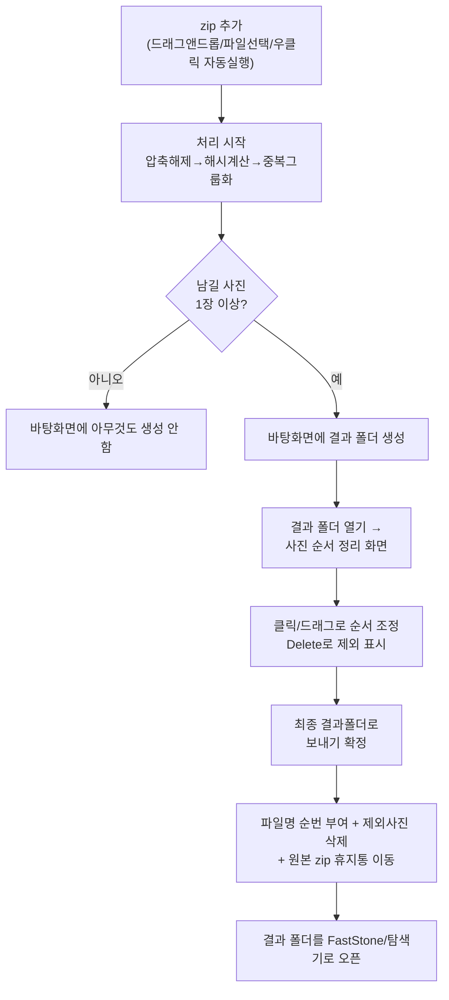

# 00. 프로젝트 한 장 요약

> 실제 소스코드(`app/core.py`, `app/gui.py`, `app/cli.py`, `main.py`)와 저장소 상태(`git log`,
> `git remote -v`)를 직접 확인해 작성했습니다. 추측한 내용은 없으며, 확인되지 않은 부분은
> `확인 필요`로 표시합니다.

## 프로그램 목적

zip으로 압축된 사진 묶음 안에서 **파일명이 달라도 내용이 같은(또는 사실상 같은) 중복 사진**을
자동으로 찾아, 각 중복 그룹마다 **zip 내부에 가장 먼저 등장한 사진 1장만** 남기고 바탕화면에
결과 폴더를 만드는 Windows 데스크톱 프로그램입니다. (근거: `README.md` 1~5행)

## 핵심 기능

- zip 드래그앤드롭 / 파일선택 / 탐색기 **우클릭 자동실행**("중복 사진 정리 도구로 열기")
- **pHash(perceptual hash)** 기반 중복 판정 — 완전 동일 + 재압축/화질변경 등 유사 사진까지 탐지,
  회전/좌우반전 옵션 지원
- **사진 순서 정리 화면**(그리드뷰): 클릭/Shift+클릭 선택, 드래그 재정렬, Delete 제외 표시,
  Ctrl+Z 실행취소(최대 50단계)
- 확정 시 파일명에 순번 부여, 원본 zip은 완전삭제 대신 **휴지통 이동**(복구 가능), 결과 폴더를
  FastStone Image Viewer(있으면) 또는 탐색기로 자동 오픈
- 리포트 파일이나 zip 재압축 없이 **바탕화면 결과 폴더 하나**로만 결과를 남김

## 입력 / 출력

| 구분 | 내용 | 근거 |
|---|---|---|
| 입력 | zip 파일(복수 가능), pHash 임계값(0~20, 기본 5), 회전/반전 판정 여부(기본 켜짐) | `app/gui.py` `_on_drop`/`_on_pick_files`/`threshold_var`/`rotate_flip_var` |
| 출력 | 바탕화면 `결과_유니크사진_YYYYMMDD_HHMMSS` 폴더 (남길 사진 0장이면 아무것도 생성 안 함) | `app/core.py` `process_zips()` 363~372행 |
| 확정 시 부가 출력 | 순번 붙은 파일명, 원본 zip 휴지통 이동, FastStone/탐색기 오픈 | `app/gui.py` `OrderEditor._confirm()` |

## 전체 Workflow

## 현재 완성 상태

| 항목 | 상태 | 근거 |
|---|---|---|
| 핵심 기능 개발 | **완료** | `app/core.py`, `app/gui.py`, `app/cli.py` 전부 동작하는 상태로 존재 |
| exe 빌드 | **완료** | `build.bat`으로 `dist/PhotoDedup.exe` 생성 확인됨 |
| 설치 프로그램 빌드 | **완료** | `installer.iss` → `installer_output/PhotoDedup_Setup_1.0.0.exe` |
| GitHub 저장소 | **완료** — `https://github.com/cjhtop9234ppp-tech/photo-dedup` (Private) | `git remote -v` 직접 확인 |
| GitHub Release | **완료** — `v1.0.0`, 설치 파일 Asset 등록됨 | `gh release view` 직접 확인 |
| 실사용 여부 | 실제 사용자가 사용 중임을 이전 세션에서 확인(구체적 업무 데이터는 이 문서에 기록하지 않음) | `확인 필요`(정량적 사용 통계는 없음, 정성적 확인만 있음) |

## 관련 문서
- [[01_프로그램_전체구조]]
- [[02_실행_FLOW]]
- [[11_SKILL_역분석_MASTER]]
