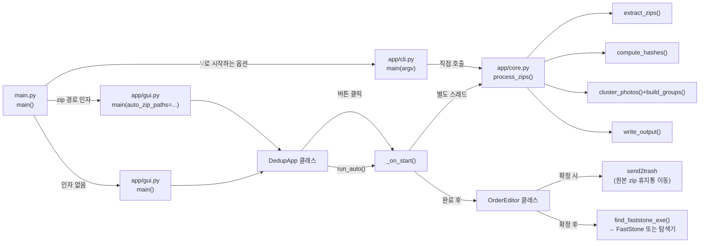

# 01. 프로그램 전체 구조

## 실제 디렉터리 구조 (직접 조사, GitHub 저장소 기준)

```text
PhotoDedup/                    (GitHub: cjhtop9234ppp-tech/photo-dedup, Private)
├── app/
│   ├── __init__.py            # 0줄, 빈 파일 — app을 파이썬 패키지로 인식시키는 용도
│   ├── core.py                 # 388줄, 핵심 로직 (해시/중복판정/파일생성)
│   ├── cli.py                   # 76줄, 콘솔(CLI) 진입점
│   └── gui.py                    # 922줄, GUI 전체 (DedupApp, OrderEditor)
├── main.py                       # 35줄, 프로그램 진입점
├── requirements.txt                # 5줄, 의존성 목록
├── build.bat                         # 26줄, exe+설치프로그램 빌드 스크립트
├── installer.iss                      # 46줄, Inno Setup 설치 스크립트
├── README.md                           # 168줄, GitHub용 사용 설명서
├── LICENSE                               # 21줄, MIT License
├── REPRODUCTION_GUIDE.md                   # 1980줄, 전체 소스 포함 재현 가이드
├── docs/                                     # 이 문서 세트(인수인계용, 이 폴더)
├── venv/, build/, dist/, installer_output/     # (재현/빌드 시 생성, git 추적 대상 아님)
└── .git/                                         # git 저장소 (master 브랜치, origin 연결됨)
```

`venv/`, `build/`, `dist/`, `installer_output/`, `app/__pycache__/`, `PhotoDedup.spec`은 `.gitignore`에
등록되어 GitHub에 올라가지 않습니다. 이전 개발 과정에서 만든 `옵시디언_노트/`,
`PhotoDedup_SKILL_역분석_MASTER/` 두 폴더도 실제 업무 맥락이 언급될 수 있어 `.gitignore`로 제외되어
있습니다(로컬에는 남아있으나 GitHub 저장소에는 없음) — [[08_백업_복구_GitHub]] 참고.

## 주요 파일 표

| 구분 | 실제 파일 | 핵심 역할 | 주요 함수/클래스 | 입력 | 출력 |
|---|---|---|---|---|---|
| 진입점 | `main.py` | 실행 인자에 따라 GUI/자동실행 GUI/CLI 분기 | `main()` | `sys.argv` | GUI 또는 CLI 실행 |
| 패키지 표시 | `app/__init__.py` | `app`을 파이썬 패키지로 인식시킴 | 없음 | 없음 | 없음 |
| 핵심 로직 | `app/core.py` | 압축해제·해시계산·중복그룹화·결과폴더생성 | `PhotoItem`, `DupGroup`, `ProcessResult`, `get_desktop_path`, `extract_zips`, `compute_hashes`, `UnionFind`, `BKTree`, `cluster_photos`, `build_groups`, `write_output`, `process_zips` | zip 경로 목록, 임계값, 회전옵션 | `ProcessResult` 객체 |
| CLI | `app/cli.py` | 콘솔에서 `core.process_zips` 호출 | `main(argv)` | 명령줄 인자(`argparse`) | 콘솔 출력 |
| GUI | `app/gui.py` | tkinter 화면 전체, 순서 편집 창 포함 | `DedupApp`, `OrderEditor`, `find_faststone_exe`, `_strip_order_prefix` | 마우스/키보드 입력 | 화면 표시 + 파일시스템 결과 |
| 의존성 정의 | `requirements.txt` | pip 설치 대상 목록 | - | - | - |
| 빌드 스크립트 | `build.bat` | PyInstaller + Inno Setup 실행 | - | `main.py` | `dist/PhotoDedup.exe`, `installer_output/*.exe` |
| 설치 스크립트 | `installer.iss` | Inno Setup 설치 프로그램 정의 | `[Setup]`,`[Tasks]`,`[Files]`,`[Icons]`,`[Registry]`,`[Run]` | `dist/PhotoDedup.exe` | `PhotoDedup_Setup_1.0.0.exe` |

## 모듈 호출 관계



## 외부 라이브러리 (`requirements.txt` 실제 내용)

| 라이브러리 | 사용 위치 | 역할 |
|---|---|---|
| `Pillow` | `app/core.py`, `app/gui.py` | 이미지 열기, EXIF 회전 정규화, 썸네일 |
| `imagehash` | `app/core.py` | pHash 계산 |
| `tkinterdnd2` | `app/gui.py` | 드래그앤드롭 |
| `send2trash` | `app/gui.py` | 원본 zip 휴지통 이동 |
| `pyinstaller` | 빌드 시에만 | exe 생성 |

## 관련 문서
- [[00_프로젝트_한장요약]]
- [[02_실행_FLOW]]
