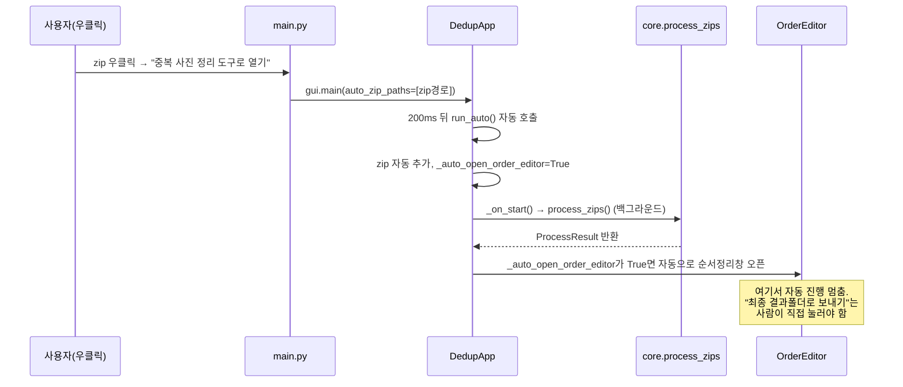

# 02. 실행 FLOW (시작 → 종료까지 실제 처리 순서)

`main.py`, `app/gui.py`, `app/core.py`, `app/cli.py`의 실제 코드 흐름을 그대로 추적했습니다.

## 진입점 분기 (`main.py` 16~35행)

```text
main.py: main() 호출
├─ sys.argv[1:] 가 있고, 첫 인자가 "-"로 시작하지 않으면
│    └─ ".zip"으로 끝나는 인자가 있으면 → app/gui.py main(auto_zip_paths=zip_paths) 호출 (자동 실행 모드)
├─ sys.argv[1:] 가 있으면(위에 해당 안 될 때) → app/cli.py main(args) 호출 (CLI 모드)
└─ sys.argv[1:] 가 없으면 → app/gui.py main() 호출 (일반 GUI 모드)
```

## 분기 A: 일반 GUI 모드

| 단계 | 담당 파일/함수 | 입력 | 처리 | 출력 | 실패 시 |
|---|---|---|---|---|---|
| 1 | `app/gui.py` `main()` | - | `TkinterDnD.Tk()`/`tk.Tk()` 루트 생성, `DedupApp(root)` | 화면 표시 | tkinterdnd2 임포트 실패 시 `_HAS_DND=False`로 일반 `tk.Tk()` 사용 |
| 2 | `DedupApp._on_drop`/`_on_pick_files` | zip 경로(들) | `.zip` 필터링 후 `self.zip_paths`에 추가 | 파일 목록 UI 갱신 | zip 아닌 파일 드롭 시 경고 후 제외 |
| 3 | `DedupApp._on_start` | zip_paths, 슬라이더/체크박스값 | `tempfile.mkdtemp()`, `threading.Thread`로 `core.process_zips` 백그라운드 실행 | 스레드 시작 | zip_paths 비어있으면 경고 후 중단 |
| 4 | (백그라운드) `core.process_zips` | zip경로, work_dir, 임계값, 회전옵션 | [[11_SKILL_역분석_MASTER]] 참고 | `ProcessResult` | 예외 시 `("error", msg)`를 큐에 전달 |
| 5 | `DedupApp._poll_queue`(100ms 주기) | 큐 메시지 | 진행률/상태 갱신 | 화면 갱신 | 큐 비어있으면 `queue.Empty` 무시 |
| 6 | `DedupApp._on_process_done` | `ProcessResult` | 요약 표시, 버튼 활성화(결과 있을 때만) | 화면 요약 | `output_dir`가 빈 문자열이면 버튼 비활성화 |
| 7 | `DedupApp._on_edit_order` | `self.result` | `OrderEditor` 생성 | 순서 정리 창 오픈 | 결과 폴더 없으면 조용히 리턴 |
| 8 | `OrderEditor` 이벤트들 | 마우스/키보드 | 선택/재정렬/삭제표시/실행취소 | 화면 상태 변경 | - |
| 9 | `OrderEditor._confirm` | 현재 순서, 삭제목록, zip경로 | 확인팝업→리네임→삭제→휴지통이동→뷰어오픈 | 파일시스템 변경 | 예외 시 오류팝업 |
| 10 | `DedupApp._on_close` | - | 임시 폴더 `shutil.rmtree` | 임시 파일 정리 | 실패 무시(`ignore_errors=True`) |

## 분기 B: 자동 실행 모드 (zip 우클릭)



## 분기 C: CLI 모드

| 단계 | 내용 |
|---|---|
| 1 | `argparse`로 `zips`(필수, 복수), `--threshold`(기본5), `--rotate-flip` 파싱 |
| 2 | 각 zip 경로 존재 확인(`Path.exists()`), 확장자 검사는 안 함 |
| 3 | `tempfile.TemporaryDirectory()` 안에서 `core.process_zips()` 동기 호출 |
| 4 | 콘솔에 결과 출력, `output_dir`가 비어있으면 "처리 가능한 사진이 없어 결과 폴더를 생성하지 않았습니다." |

CLI에는 `OrderEditor`가 없으므로 순번부여/삭제/zip이동/뷰어실행은 **CLI에서 발생하지 않습니다.**

## 관련 문서
- [[00_프로젝트_한장요약]]
- [[11_SKILL_역분석_MASTER]]
- [[05_오류_및_해결이력]]
