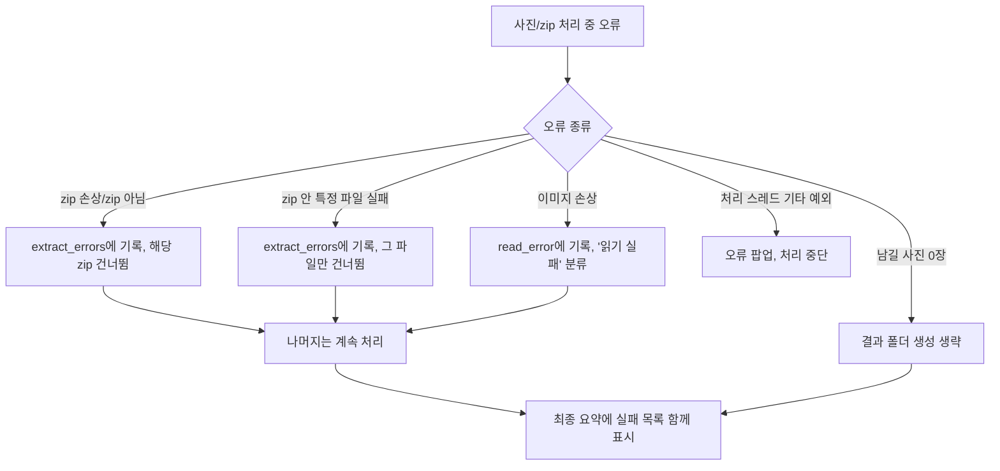

# 05. 오류 및 해결 이력

이 프로젝트의 git 커밋 이력은 2개뿐이라(`96cbae3` 최초 공개, `73fb964` README 링크 수정) 대부분의
개발 과정은 커밋 로그가 아니라 실제 코드에 남은 근거와 개발 세션 기록을 기준으로 정리했습니다.
추측으로 지어낸 과거 오류는 없습니다.

## 코드 내 실제 오류 처리 구조 (`app/core.py`)

| 오류 상황 | 코드 위치 | 처리 방식 |
|---|---|---|
| zip이 아니거나 손상된 파일 | `extract_zips` `except zipfile.BadZipFile` | `errors`에 기록, 해당 zip 건너뜀 |
| zip 경로 없음 | `extract_zips` `except FileNotFoundError` | 동일 |
| 암호 걸린 zip 항목 | `extract_zips` `except RuntimeError` | 그 파일만 건너뜀 |
| 이미지 열기/해시 실패 | `compute_hashes` `except Exception` | `item.read_error`에 기록, "읽기 실패" 목록으로 분류 |
| 바탕화면 경로 조회 실패 | `get_desktop_path` `except Exception` | `Path.home()/"Desktop"`으로 조용히 대체 |
| 처리 가능한 사진 0장 | `process_zips` `if groups:` 분기 | 결과 폴더 자체를 생성하지 않음 |

## 오류 → 복구 FLOW

## 실제 발생·수정된 이력

| 오류 | 발생 원인 | 해결 방법 | 재발 방지 |
|---|---|---|---|
| zip이 아닌 파일(PDF 등)을 넣으면 빈 결과 폴더가 바탕화면에 생성됨 | `process_zips`가 `groups` 빈 여부를 확인하지 않고 항상 `write_output()`(→`mkdir`) 호출 | `if groups:`로 감싸서 남길 사진이 없으면 폴더 생성 자체를 생략 (`app/core.py`) | 실사용 중 발견된 사례로 재현 → 수정 → 재현 안 됨을 재확인. 코드에 가드가 남아있는 한 재발 불가 |
| 순서 편집 화면에서 선택 사진을 `set()`에 담으려다 `TypeError: unhashable type` | `@dataclass`가 `eq=True`+`frozen=False`이면 `__hash__=None`이 됨 | `PhotoItem`을 `@dataclass(eq=False)`로 선언 | [[10_AI_HANDOFF]] "절대 변경 금지" 항목에 등록 |
| Canvas 위 자식 위젯에서 드래그해도 스크롤 안 됨 | tkinter 마우스 이벤트는 발생 위젯에만 전달, 부모로 자동 전파 안 됨 | 모든 자식 위젯에 동일 핸들러 재귀 바인딩, `event.x_root`/`y_root`(절대좌표) 사용 | 동일 패턴을 `OrderEditor` 드래그 재정렬에도 재사용 |
| Git Bash(MSYS)에서 설치 프로그램에 `/VERYSILENT` 옵션이 무시됨 | MSYS가 `/`로 시작하는 단독 인자를 유닉스 경로로 착각해 치환 | Inno Setup이 지원하는 `//VERYSILENT`(슬래시 두 개) 사용 | README "오류 해결" 표에 명시, 탐색기 더블클릭 실행 시엔 해당 없음 |
| **(GitHub 공개 준비 중 발견)** 소스코드에 특정 PC의 Windows 계정명이 하드코딩되어 있었음 | `app/gui.py`의 다운로드 폴더 기본경로가 `r"C:\Users\<계정명>\Downloads"`로 고정 | `Path.home() / "Downloads"`로 일반화 — 동일 PC에서도 동작 동일함을 재검증 후 반영 | 공개 저장소용 보안/개인정보 점검 절차에 포함(향후 유사 하드코딩 재검토 필요 시 `grep`으로 사용자명/절대경로 검색) |
| (v1.1.0, 실사용 중 발견) "파일자동읽기 폴더지정" 감시를 켠 채로(트레이 상주) zip 파일을 또 열면 창이 2개 뜨고 처리가 제대로 안 됨 | 프로그램에 중복 실행 방지 장치가 없어서, 감시 중인 인스턴스가 이미 떠 있는 상태에서 zip을 다시 열면(우클릭 "열기" 등) 완전히 별개인 두 번째 프로세스가 생성됨. 두 프로세스가 각자 독립적으로 같은 폴더를 감시/처리하다 같은 결과 폴더에 동시에 쓰려고 부딪힘 | `app/singleinstance.py` 추가 — Windows 명명된 뮤텍스로 "이미 실행 중인지" 확인하고, 이미 떠 있으면 새 창을 띄우지 않고 그 인스턴스에 zip 처리를 요청만 넘김(v1.1.1) | 실제 PC에서 재현 확인 후 수정 → 동일 시나리오(감시 켜진 채로 zip 재실행)에서 창이 1개만 뜨고 정상 처리되는지 재검증 완료 |
| (v1.1.0/v1.1.1, 사용성 피드백) 감시 폴더에 zip이 들어올 때마다 프로그램 창이 자동으로 튀어나와 다른 작업을 방해함 | `run_auto()`가 감시 폴더 자동 감지든 사람이 직접 연 것이든 항상 창을 강제로 보여줌(`root.deiconify()`) | `run_auto(silent=True/False)` 구분 추가 — 감시 폴더 자동 감지는 `silent=True`로 창/순서정리창을 전혀 띄우지 않고 조용히 처리, 사람이 직접 연 경우만 `silent=False`로 창을 보여줌. 대신 바탕화면 아이콘이나 트레이 아이콘을 더블클릭하면 그때 창이 열리고 결과가 표시됨(v1.1.2) | 실제 PC에서 `--tray` 감시 중 감시 폴더에 zip을 넣어 창이 안 뜨는지, 이후 더블클릭 시 결과가 표시되는지 재검증 완료 |
| (v1.1.0~v1.1.2, 실사용 중 발견) 같은 파일명으로 zip을 다시 다운로드(덮어쓰기)해도 감시가 영원히 반응하지 않음 | `FolderWatcher`가 "이미 본 파일"을 파일명만으로 기억(`set[str]`)해서, 같은 이름으로 재다운로드돼 내용이 완전히 바뀌어도 "예전에 봤던 이름"이라 무시함. 사용자가 실제로 같은 원본 파일을 반복해서 테스트/재다운로드하다가 발견 | 파일명 대신 수정시각(mtime)을 기억하도록 변경(`dict[str, float]`) — 같은 이름이라도 mtime이 예전보다 최신이면 "바뀐 파일"로 다시 처리함(v1.1.3) | 감시 시작 전부터 있던 파일은 그대로 무시되고, 그 파일을 같은 이름으로 덮어쓰면 다시 감지되는지 격리 테스트로 재검증 완료 |
| (v1.1.0~v1.1.3, 사용성 피드백) 확정("최종 결과폴더로 보내기") 뒤에 원본 zip 삭제 + FastStone 열기 외에 "완료했습니다" 안내 팝업까지 남아있어, 조용한 처리 흐름과 안 맞음 | `OrderEditor._confirm()`이 성공 여부와 관계없이 항상 `messagebox.showinfo()`로 요약 팝업을 띄움 | 성공 시에는 팝업 없이 곧바로 FastStone만 뜨도록 변경, 삭제 실패 등 예외 상황일 때만 `showwarning()`으로 경고 팝업을 띄움. 확정 뒤 메인 창도 트레이가 떠 있으면 다시 숨김(`_hide_to_tray_if_active`)(v1.1.4) | 실제 OS 클릭 자동화가 이 환경에서 불안정하게 동작해(다른 창에 입력이 새는 문제 발견) 대신 `unittest.mock`으로 `_confirm()`을 직접 호출해 팝업 미표시/뷰어 호출/창 숨김을 코드 레벨로 검증 완료 |

## `확인 필요`

- 프로그램이 로그 파일을 디스크에 남기는지: **남기지 않음이 확인됨**(`logging` 모듈/파일 쓰기 코드
  없음). 화면 로그창과 콘솔 출력만 있고 파일로 저장되지 않습니다.

## 관련 문서
- [[02_실행_FLOW]]
- [[06_유지보수_가이드]]
- [[10_AI_HANDOFF]]
