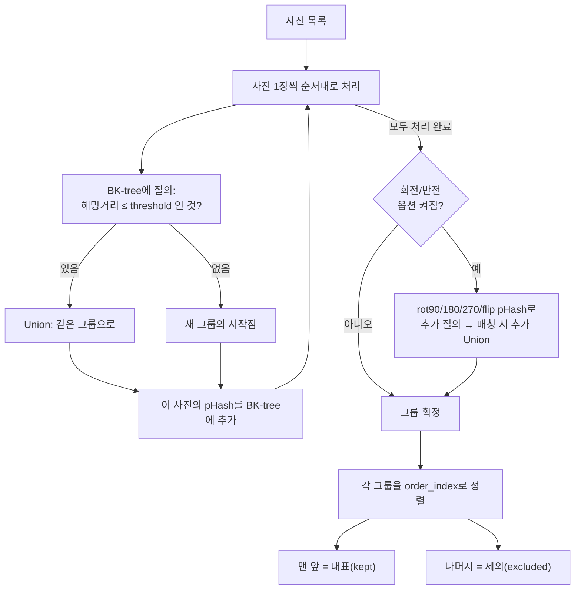
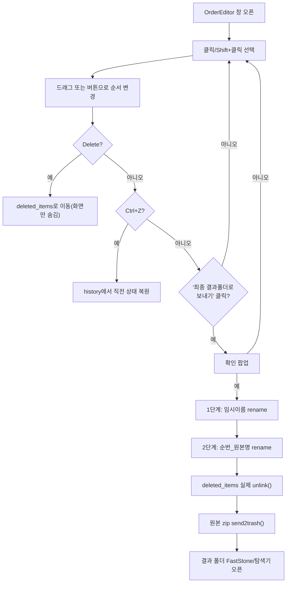
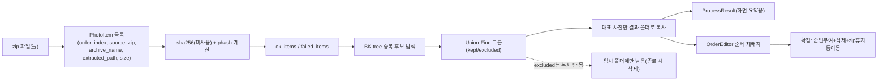

# 11. SKILL 역분석 MASTER — PhotoDedup 전체 처리과정 교육자료

> 이 문서는 `app/core.py`, `app/gui.py`를 직접 읽고 실제 코드만 근거로 작성했습니다. 추측한
> 내용은 없으며 확인되지 않은 부분은 `확인 필요`로 표시합니다. [[00_프로젝트_한장요약]],
> [[02_실행_FLOW]]가 "무엇을, 어떤 순서로"를 다룬다면, 이 문서는 **"왜 그렇게 판정하고
> 처리하는가"**를 코드 줄 단위로 파고듭니다.

## 요약 (가장 중요한 발견)

**실제 중복 판정은 pHash(perceptual hash) 하나만 사용합니다.** 코드 주석은 "sha256 + pHash
이중 판별"이라고 말하지만, 실제 그룹화 로직(`cluster_photos`)은 `item.phash`/`item.phash_variants`만
읽고, `item.sha256`은 계산만 되고 전체 코드베이스 어디에서도 비교에 쓰이지 않습니다(grep 확인:
`.sha256`을 읽는 코드 0건). 다행히 완전 동일 파일도 pHash 해밍거리 0으로 자연히 잡히므로
기능적 결함은 아닙니다.

---

## 1부: 중복 사진 판정 로직

### 1-1. 1차 후보 선정: 전체 비교(N×N)인가, 후보군을 좁히는가?

**후보군을 좁힙니다.** `BKTree`(BK-tree, 해밍거리 기반 트리)로 근사 최근접 탐색을 합니다.

```python
# app/core.py — cluster_photos()
base_tree = BKTree()
for i in range(n):
    matches = base_tree.query(ok_items[i].phash, threshold)
    for j in matches:
        uf.union(i, j)
    base_tree.add(ok_items[i].phash, i)
```

`쉽게 말하면`: 사진 10,000장을 10,000×10,000번 비교하는 게 아니라, "지금까지 본 사진 서랍
(BK-tree)"에 새 사진을 넣기 전에 "이 안에 나랑 비슷한 게 있나?"만 빠르게 찾아보는 방식입니다.

### 1-2. 비교 기준 (실제 사용 여부)

| 항목 | 실제 사용 여부 |
|---|---|
| 파일명, 파일 크기 | 미사용 |
| SHA-256 해시 | **계산되지만 미사용**(죽은 코드) |
| 이미지 해시(pHash) | **사용 — 유일한 판정 기준** |
| 해상도, 촬영시간/EXIF(비교 목적), 픽셀 직접비교, AI 분석 | 미사용 (EXIF는 회전 정규화에만 사용) |
| 유사도 점수(해밍거리) | 사용 |

### 1-3. 중복 판정 조건식

```text
해밍거리(pHash_A, pHash_B) <= threshold  → 같은 사진(중복)
해밍거리(pHash_A, pHash_B) > threshold   → 다른 사진
```

- 기본 `threshold = 5`, GUI 슬라이더로 0~20 조절. 0에 가까울수록 엄격, 20에 가까울수록 느슨.
- 완전 동일 파일은 pHash도 동일(해밍거리 0)해서 어떤 threshold에서도 항상 중복으로 잡힘.

### 1-4. 중복 그룹 생성 (연쇄 관계)

**Union-Find(서로소 집합)**로 처리합니다. A-B가 임계값 이내, B-C가 임계값 이내면 A-C를 직접
비교하지 않아도 A,B,C가 모두 한 그룹으로 묶입니다.

`쉽게 말하면`: "A랑 B가 닮았고 B랑 C가 닮았으면, A랑 C를 직접 안 비교해봤어도 셋을 한 그룹으로
묶는다"는 뜻. 재압축을 여러 단계 거친 사진들이 사슬처럼 이어져 있어도 하나의 그룹으로 잡힙니다.

### 1-5. 대표 사진 선정 기준

```python
# app/core.py — build_groups()
idxs.sort(key=lambda i: ok_items[i].order_index)   # zip 내 등장 순서로 정렬
kept = ok_items[idxs[0]]                              # 가장 먼저 나온 사진이 대표
```

**유일한 기준은 zip 내부 등장 순서(가장 먼저 나온 것)** 입니다. 고해상도/파일크기/촬영일/
생성일/특정폴더 우선 같은 기준은 전혀 사용하지 않습니다.

### 회전/반전 옵션

켜져 있으면(GUI 기본값 켜짐) 원본 pHash 외에 90/180/270도 회전본과 좌우반전본의 pHash도
계산해서 원본 방향 BK-tree에 추가로 질의합니다 — 회전/반전만 다른 사진도 같은 그룹으로 묶임.

### 판정 FLOW



---

## 2부: 사진 정리 처리 로직

### 처리 기능 표

| 처리 기능 | 구현 여부 | 안전장치 |
|---|---|---|
| 원본(대표) 유지 | 구현(복사만, 원본 zip 안 건드림) | `shutil.copy2()` |
| 중복(제외) 삭제 | **1차 처리 단계에서는 구현 안 됨** | 그냥 복사에서 빠질 뿐, 별도 삭제 없음 |
| 휴지통 이동 | 구현(원본 zip만 대상) | `send2trash()`, 완전삭제 아님 |
| 별도 폴더로 이동(제외 사진) | 구현 안 됨 | - |
| 파일명 변경 | 구현(확정 시에만) | 2단계 안전 리네임 |
| 폴더 생성 | 구현(남길 사진 0장이면 생성 안 함) | - |
| 백업 | 구현 안 됨 | - |
| 사용자 확인(컨펌) | 구현 | `messagebox.askyesno()` |
| 자동 처리 | 부분 구현(확정 단계는 항상 사람이) | 의도적 설계 |
| 실행취소(Ctrl+Z) | 구현(순서 편집 중에만, 최대 50단계) | 확정 이후엔 취소 불가 |
| 삭제 표시(Delete) | 구현(확정 전엔 즉시 삭제 아님) | 확정 시에만 `unlink()` |

### 안전장치 7가지 요약

1. 1차 처리(`process_zips`)는 복사만 함 — 삭제 전혀 없음
2. 확정 전까지 파일명도 안 바뀜 — 화면 조작은 메모리 상태일 뿐
3. 확정 직전 확인 팝업 — 몇 장 바뀌는지/삭제되는지/zip이 휴지통으로 가는지 안내
4. 파일명 변경은 2단계 안전 리네임(임시 UUID 이름 경유) — 순서 뒤바뀜 충돌 방지
5. 삭제 표시는 확정 전까지 "목록"에서만 빠짐 — 실제 파일은 그대로
6. 원본 zip은 완전삭제가 아니라 휴지통 이동(복구 가능)
7. 자동 실행 모드도 "확정"만큼은 자동화하지 않음

### 순서 편집 → 확정 FLOW



---

## 3부: 입력 → 출력 데이터 흐름



## 4부: 성능 분석 (`현재 구현` / `향후 개선 제안` 절대 혼합 안 함)

### 현재 구현

| 항목 | 현재 구현 |
|---|---|
| 전체 N×N 비교 여부 | 아니오 — BK-tree 근사 탐색 |
| 캐시 사용 | 아니오 — 매 실행마다 이미지 새로 열어 계산 |
| DB 사용 | 아니오 |
| 멀티스레드 | 부분적 — 처리 전체를 담당하는 백그라운드 스레드 1개만(UI 반응성 목적), 해시 계산 자체는 순차 |
| 멀티프로세스 / 비동기 / GPU | 전부 아니오 |
| 메모리 구조 | 이미지를 통째로 메모리에 읽어 처리(스트리밍 아님) |
| 배치 처리 | 아니오 — 한 장씩 순차 |
| 인덱싱 | BK-tree 자체가 인메모리 인덱스 구조(DB 인덱스 아님) |

### 향후 개선 제안 (현재 구현 아님)

> [!향후 개선 제안] 실측 벤치마크는 존재하지 않습니다(`확인 필요`). 코드 구조상 예상되는
> 병목: 디스크 I/O + 단일 스레드 순차 처리라 사진 수에 거의 선형으로 시간이 늘어날 것으로
> 예상됩니다. 수천~수만 장 단위 실측이 필요하면 별도로 벤치마크를 만들어야 합니다.

## 관련 문서
- [[00_프로젝트_한장요약]]
- [[02_실행_FLOW]]
- [[09_향후개발_TODO]]
